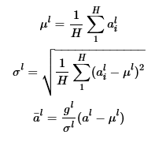

# Feed Forward Neural Network

The Jupyter Notebook is Self Explanatory

**Latest Update**

- **Layer Normalization - Usage:**  ```layer_norm = True
                                    ```   
  
The layer normalization method is designed to overcome the drawbacks of batch normalization.t changes in the output of one layer will tend to cause highly correlated changes in the
summed inputs to the next layer, especially with ReLU units whose outputs can change by a lot.
This suggests the “covariate shift” problem can be reduced by fixing the mean and the variance of
the summed inputs within each layer. We, thus, compute the layer normalization /mu and /sigma statistics over all
the hidden units in the same layer as follow. The normalized layer outputs are also given below, where g is the gain parameter.


Equation [1](https://docs.google.com/document/d/1Iw_TUijQ-C6F0M3mWWco8_rDiuEblKvtr8mCB3ITLas/edit#bookmark=id.ih4sqznq0mj9)

```
H - Number of Neurons in Layer l
   ```

Unlike batch normalization,
layer normaliztion does not impose any constraint on the size of a mini-batch and it can be used in
the pure online regime with batch size 1.
